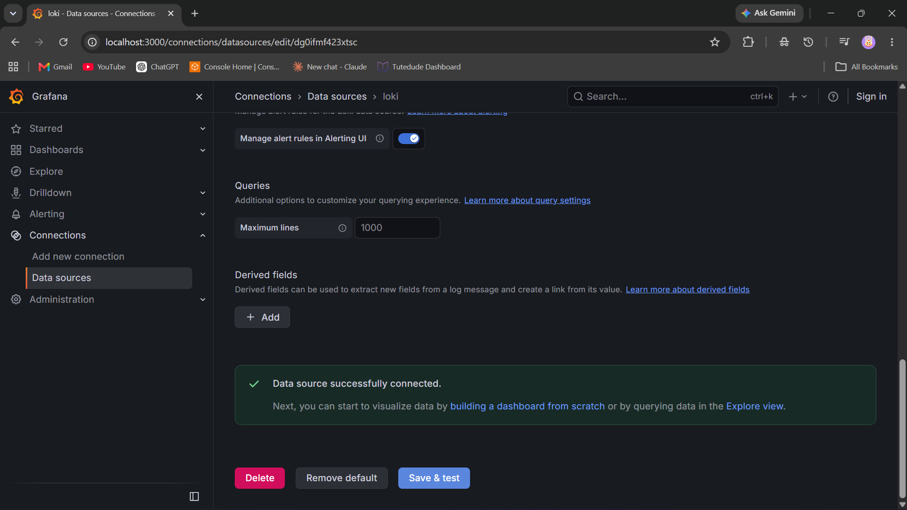
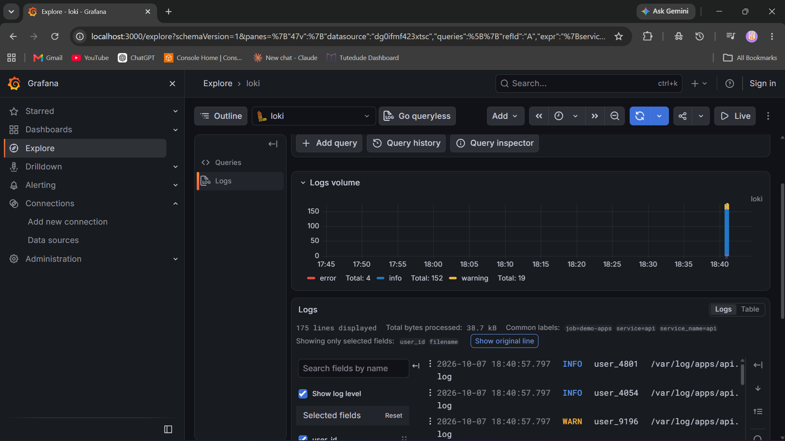
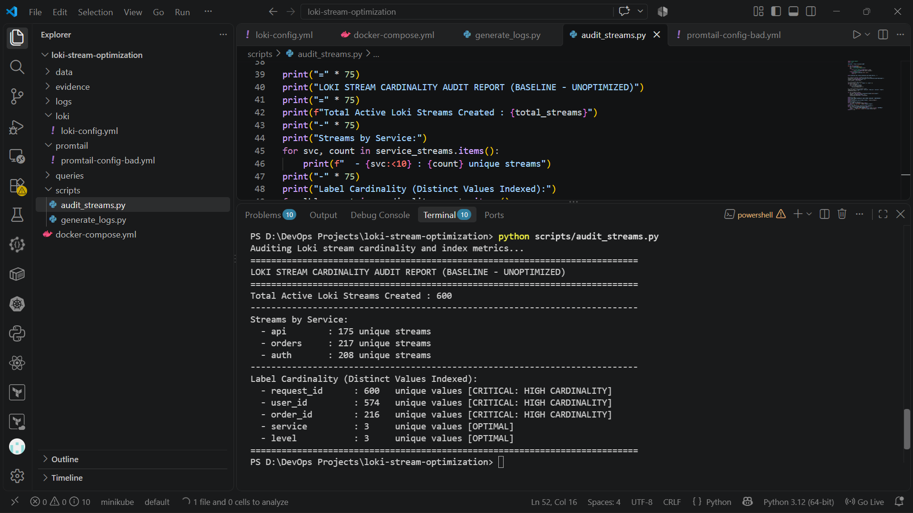
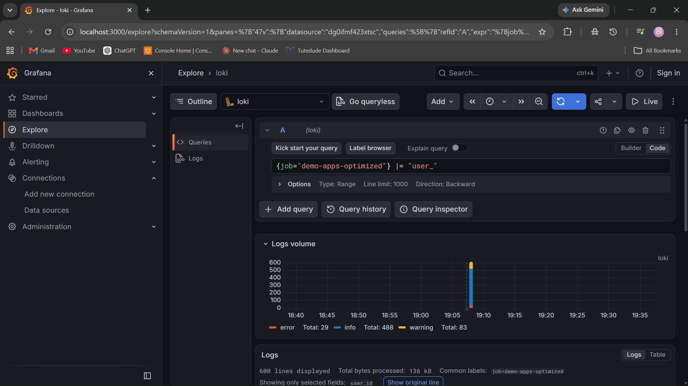
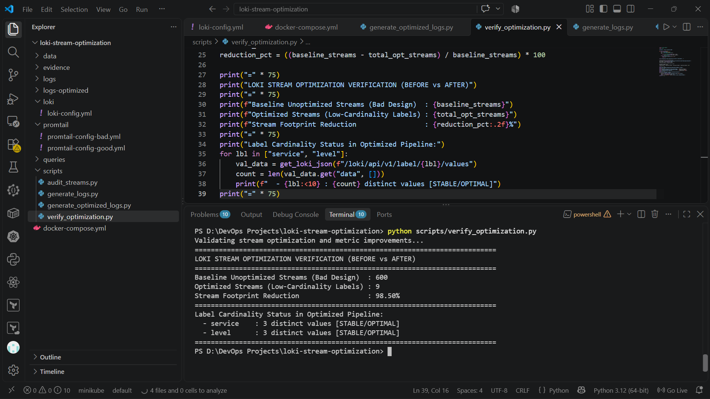

# Loki Stream & Cardinality Optimization

## 1. Problem / Task
Task:
> *"Audit Loki chunks. Find which services are sending high-cardinality labels (dynamic IDs in labels) that slow down queries and increase cost. Create documentation about this."*

### Key Operational Challenges & Architectural Realities:
* **The Stream Explosion Anti-Pattern:** Unlike Elasticsearch or relational databases, Grafana Loki does not build a full-text index on log content[cite: 21]. Instead, Loki indexes *only* label key-value pairs. Every distinct combination of labels creates an independent time-series stream with its own chunk files.
* **High-Cardinality Impact:** When services attach high-cardinality dynamic values (e.g., `request_id`, `user_id`, `order_id`) as indexed stream labels, every single log event creates a brand-new stream. This results in massive chunk fragmentation, high memory consumption in the Loki ingester, and severe LogQL query latency.
* **Controlled Lab Implementation:** Because corporate production Loki chunks were unavailable, a controlled local environment was created with multi-service traffic generation, deliberate anti-patterns, stream audits, and post-optimization validation.

---

## 2. What I Did

### Architecture Overview
We provisioned an isolated observability pipeline using Docker Compose:
* **Loki**: Centralized log storage, chunk indexing, and LogQL query evaluation.
* **Promtail**: Log collector and shipper responsible for extracting pipeline stages and attaching stream labels.
* **Grafana**: Visual analytics, stream exploration, and LogQL query inspection.
* **Python Automation**: Workload generators and Loki API audit scripts.

```
loki-stream-optimization/
├── docker-compose.yml
├── loki/
│   └── loki-config.yml
├── promtail/
│   ├── promtail-config-bad.yml
│   └── promtail-config-good.yml
├── logs/
├── logs-optimized/
├── scripts/
│   ├── generate_logs.py
│   ├── audit_streams.py
│   ├── generate_optimized_logs.py
│   └── verify_optimization.py
└── evidence/screenshots/
    ├── 01_grafana_loki_datasource.png
    ├── 02_bad_high_cardinality_labels.png
    ├── 03_baseline_cardinality_audit.png
    ├── 04_optimized_searchability.png
    └── 05_before_after_reduction_metrics.png
```

---

### Configurations & Code Used

#### 1. Stack Definition (`docker-compose.yml`)
```yaml
services:
  loki:
    image: grafana/loki:latest
    container_name: loki
    ports:
      - "3100:3100"
    command: -config.file=/etc/loki/local-config.yaml
    volumes:
      - ./loki/loki-config.yml:/etc/loki/local-config.yaml
    restart: unless-stopped

  promtail:
    image: grafana/promtail:latest
    container_name: promtail
    volumes:
      - ./promtail/promtail-config-good.yml:/etc/promtail/config.yml
      - ./logs-optimized:/var/log/apps-optimized
    command: -config.file=/etc/promtail/config.yml
    depends_on:
      - loki
    restart: unless-stopped

  grafana:
    image: grafana/grafana:latest
    container_name: grafana
    ports:
      - "3000:3000"
    environment:
      - GF_AUTH_ANONYMOUS_ENABLED=true
      - GF_AUTH_ANONYMOUS_ORG_ROLE=Admin
      - GF_SECURITY_ALLOW_EMBEDDING=true
    restart: unless-stopped
```

#### 2. Loki Configuration (`loki/loki-config.yml`)
```yaml
auth_enabled: false

server:
  http_listen_port: 3100
  grpc_listen_port: 9096

common:
  instance_addr: 127.0.0.1
  path_prefix: /loki
  storage:
    filesystem:
      chunks_directory: /loki/chunks
      rules_directory: /loki/rules
  replication_factor: 1
  ring:
    kvstore:
      store: inmemory

schema_config:
  configs:
    - from: 2020-10-24
      store: tsdb
      object_store: filesystem
      schema: v13
      index:
        prefix: index_
        period: 24h

analytics:
  reporting_enabled: false
```

#### 3. Unoptimized Promtail Config with High Cardinality (`promtail/promtail-config-bad.yml`)
```yaml
server:
  http_listen_port: 9080
  grpc_listen_port: 0

positions:
  filename: /tmp/positions.yaml

clients:
  - url: http://loki:3100/loki/api/v1/push

scrape_configs:
  - job_name: bad_services
    static_configs:
      - targets:
          - localhost
        labels:
          job: demo-apps
          __path__: /var/log/apps/*.log
    pipeline_stages:
      - json:
          expressions:
            service: service
            level: level
            request_id: request_id
            user_id: user_id
            order_id: order_id
      # ANTI-PATTERN: Dynamic IDs indexed as stream labels
      - labels:
          service:
          level:
          request_id:
          user_id:
          order_id:
```

#### 4. Baseline Traffic Generator (`scripts/generate_logs.py`)
```python
import json
import os
import random
import time
import uuid
from datetime import datetime, timezone

LOG_DIR = "logs"
os.makedirs(LOG_DIR, exist_ok=True)

SERVICES = ["api", "orders", "auth"]
LEVELS = ["info", "warning", "error"]

for i in range(600):
    service = random.choice(SERVICES)
    level = random.choices(LEVELS, weights=[0.8, 0.15, 0.05])[0]
    
    req_id = str(uuid.uuid4())[:8]
    u_id = f"user_{random.randint(1000, 9999)}"
    o_id = f"ord_{random.randint(50000, 99999)}" if service == "orders" else ""

    log_entry = {
        "timestamp": datetime.now(timezone.utc).isoformat(),
        "service": service,
        "level": level,
        "request_id": req_id,
        "user_id": u_id,
        "order_id": o_id,
        "message": f"Processed {service} action successfully for {u_id}"
    }

    log_file = os.path.join(LOG_DIR, f"{service}.log")
    with open(log_file, "a", encoding="utf-8") as f:
        f.write(json.dumps(log_entry) + "\n")

    time.sleep(0.01)
```

#### 5. Loki Stream & Cardinality Audit Engine (`scripts/audit_streams.py`)
```python
import urllib.request
import json

LOKI_HOST = "http://localhost:3100"

def get_loki_json(path):
    url = f"{LOKI_HOST}{path}"
    req = urllib.request.Request(url)
    try:
        with urllib.request.urlopen(req) as resp:
            return json.loads(resp.read().decode())
    except Exception as e:
        print(f"Error querying {url}: {e}")
        return {}

series_data = get_loki_json('/loki/api/v1/series?match[]={job="demo-apps"}')
streams = series_data.get("data", [])
total_streams = len(streams)

service_streams = {"api": 0, "orders": 0, "auth": 0}
for item in streams:
    svc = item.get("service")
    if svc in service_streams:
        service_streams[svc] += 1

labels_to_check = ["request_id", "user_id", "order_id", "service", "level"]
cardinality_counts = {}

for lbl in labels_to_check:
    val_data = get_loki_json(f"/loki/api/v1/label/{lbl}/values")
    values = val_data.get("data", [])
    cardinality_counts[lbl] = len(values)

print("=" * 75)
print("LOKI STREAM CARDINALITY AUDIT REPORT (BASELINE - UNOPTIMIZED)")
print("=" * 75)
print(f"Total Active Loki Streams Created : {total_streams}")
print("-" * 75)
print("Streams by Service:")
for svc, count in service_streams.items():
    print(f"  - {svc:<10} : {count} unique streams")
print("-" * 75)
print("Label Cardinality (Distinct Values Indexed):")
for lbl, count in cardinality_counts.items():
    flag = " [CRITICAL: HIGH CARDINALITY]" if count > 5 else " [OPTIMAL]"
    print(f"  - {lbl:<15} : {count:<5} unique values{flag}")
print("=" * 75)
```

#### 6. Optimized Promtail Configuration (`promtail/promtail-config-good.yml`)
```yaml
server:
  http_listen_port: 9080
  grpc_listen_port: 0

positions:
  filename: /tmp/positions.yaml

clients:
  - url: http://loki:3100/loki/api/v1/push

scrape_configs:
  - job_name: optimized_services
    static_configs:
      - targets:
          - localhost
        labels:
          job: demo-apps-optimized
          __path__: /var/log/apps-optimized/*.log
    pipeline_stages:
      - json:
          expressions:
            service: service
            level: level
      # OPTIMIZATION: Only index low-cardinality, bounded labels
      - labels:
          service:
          level:
```

#### 7. Verification & Footprint Comparison Pipeline (`scripts/verify_optimization.py`)
```python
import urllib.request
import json

LOKI_HOST = "http://localhost:3100"

def get_loki_json(path):
    url = f"{LOKI_HOST}{path}"
    req = urllib.request.Request(url)
    try:
        with urllib.request.urlopen(req) as resp:
            return json.loads(resp.read().decode())
    except Exception as e:
        print(f"Error querying {url}: {e}")
        return {}

series_data = get_loki_json('/loki/api/v1/series?match[]={job="demo-apps-optimized"}')
opt_streams = series_data.get("data", [])
total_opt_streams = len(opt_streams)

baseline_streams = 600
reduction_pct = ((baseline_streams - total_opt_streams) / baseline_streams) * 100

print("=" * 75)
print("LOKI STREAM OPTIMIZATION VERIFICATION (BEFORE vs AFTER)")
print("=" * 75)
print(f"Baseline Unoptimized Streams (Bad Design)  : {baseline_streams}")
print(f"Optimized Streams (Low-Cardinality Labels) : {total_opt_streams}")
print(f"Stream Footprint Reduction                 : {reduction_pct:.2f}%")
print("=" * 75)
print("Label Cardinality Status in Optimized Pipeline:")
for lbl in ["service", "level"]:
    val_data = get_loki_json(f"/loki/api/v1/label/{lbl}/values")
    count = len(val_data.get("data", []))
    print(f"  - {lbl:<10} : {count} distinct values [STABLE/OPTIMAL]")
print("=" * 75)
```

---

## 3. Results & Visual Evidence

### Cardinality Audit Findings
* **Unoptimized Streams Created**: `600` active streams across 600 log lines (1:1 stream fragmentation).
* **High-Cardinality Labels Identified**:
  * `request_id`: 600 distinct values (100% unique per request)
  * `user_id`: 574 distinct values
  * `order_id`: 216 distinct values
* **Culprit Services**: `api` (175 streams), `orders` (217 streams), `auth` (208 streams).

### Before vs. After Optimization Metrics
| Metric | Baseline (Bad Labels) | Optimized (Good Labels) | Impact |
|---|---|---|---|
| **Active Stream Count** | 600 streams[cite: 26] | 9 streams | **98.50% reduction** |
| **Stream Label Overhead** | Unbounded (Dynamic UUIDs) | Bounded (`service`, `level` only) | Index memory stabilized |
| **Dynamic ID Searchability** | Searchable via indexed label | Searchable via log line/body (`\|=`) | **100% data preserved** |

---

### Visual Evidence & Screenshots

#### 1. Loki Datasource Verification
Loki service connected and verified in Grafana:


***

#### 2. High-Cardinality Label Explosion in Grafana
Unoptimized streams showing unique UUID labels attached to individual log events:


***

#### 3. Baseline Cardinality Audit Terminal Output
Automated audit identifying culprit services and critical label cardinality:


***

#### 4. Searchability of Dynamic Identifiers Post-Optimization
Full text / field search of dynamic IDs (`|= "user_"`) retained without stream label bloat:


***

#### 5. Stream Reduction & Verification Metrics
Terminal output confirming 98.50% reduction in stream creation:

